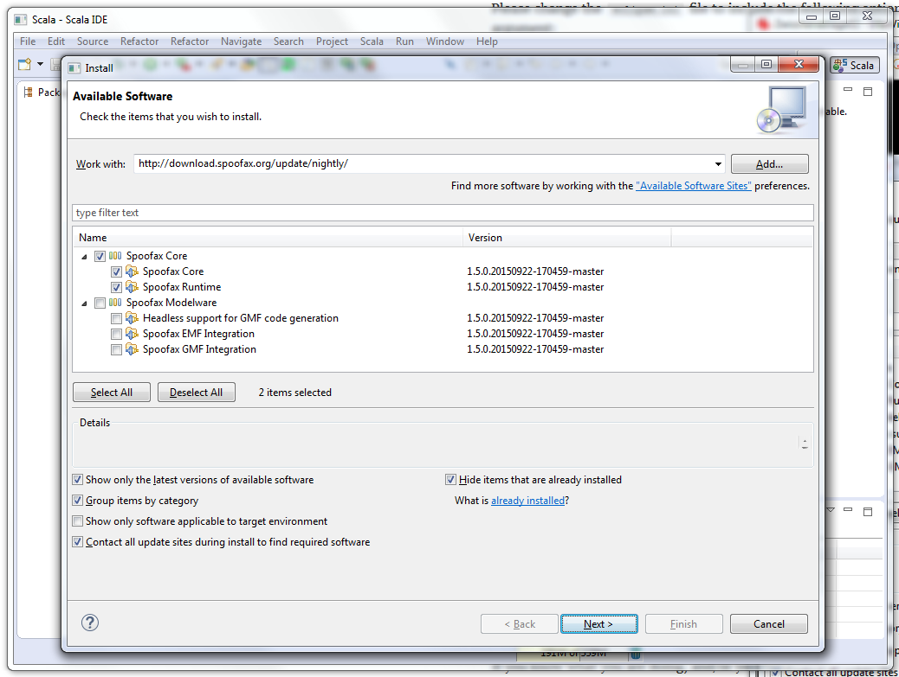
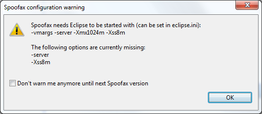
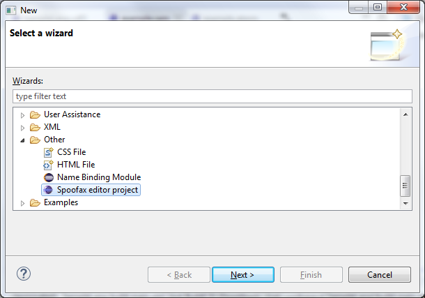
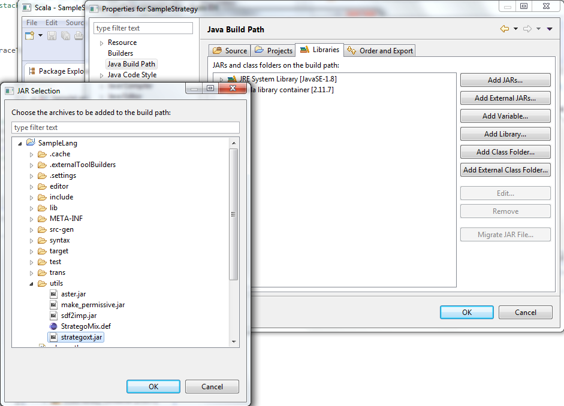
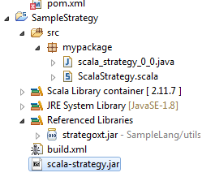
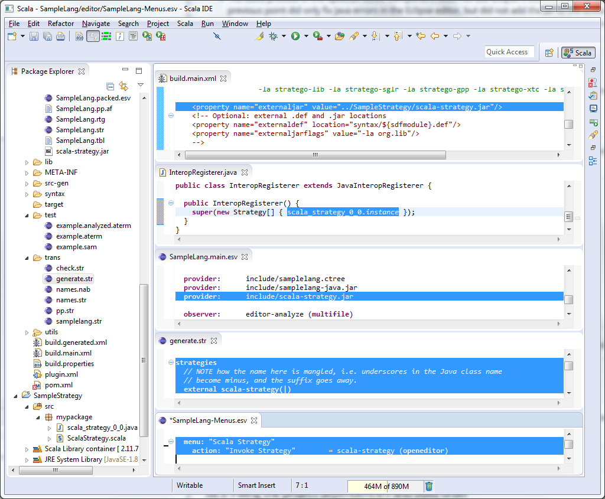
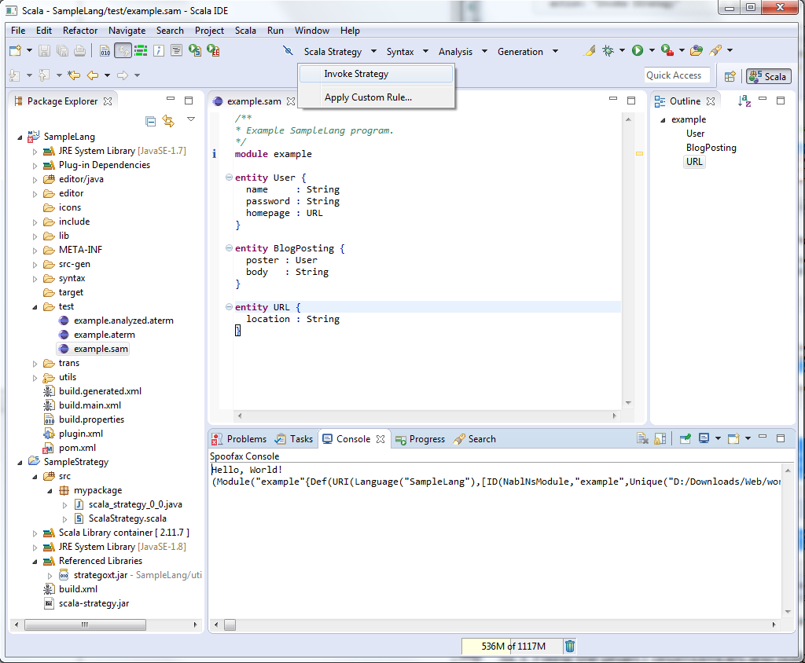
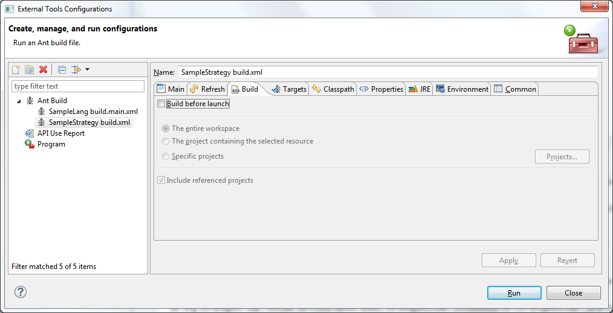
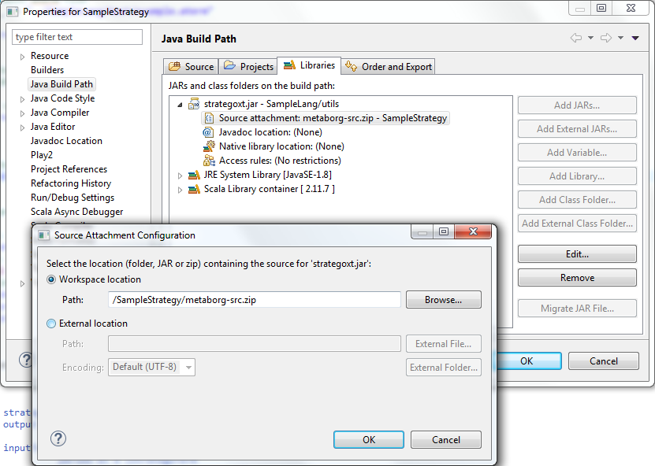

# Using Scala strategies in Spoofax

## 1. Setting up the IDE: Scala IDE with Spoofax plugin
One way of installing Spoofax and the Scala plugin in eclipse is downloading the Eclipse IDE for Java Developers ([currently Mars (4.5)](http://www.eclipse.org/downloads/packages/eclipse-ide-java-developers/marsr)) and then adding both plugins through `Help -> Install New Software...`. However, the Scala IDE offers better autocompletion, some additional interface elements and, according to the [website](http://scala-ide.org/download/sdk.html), better performance. So we used it instead of vanilla Eclipse as a basis for installing the Spoofax plugin.

The steps are as follows: 

- Install the [JDK 7 or higher](http://www.oracle.com/technetwork/java/javase/downloads/jdk8-downloads-2133151.html). The 64 bit version is recommended, since Spoofax warns you when not run with the server VM configuration (see below). The `--server` option seems to be only available in the 64 bit version.
- Download and unzip the Scala IDE from [above](http://scala-ide.org/download/sdk.html) (already includes Scala 2.11, so no need to install it manually beforehand). Make sure to download the 64 bit version.
- Launch the Scala IDE, open `Help -> Install New Software...`, and `Add...` the Spoofax nightly repository. (Stable should work fine, it is just that we used nightly.) As per the [Spoofax website](http://metaborg.org/download/) the repo URL is `http://download.spoofax.org/update/nightly/`. Select `Spoofax Core` and proceed with the installation.



- When you launch Scala IDE for the first time with Spoofax included, you might get the following warning (see the [eclipse.ini section on the Spoofax website](http://metaborg.org/download/#eclipseini) for more details). In order to fix it, add the following lines to the `eclipse.ini` in the Scala IDE's installation directory. (Note that some of the options might already be present due to the Scala IDE default configuration, just replace them.)

```
-Xss8m
-Xms256m
-Xmx1024m
-XX:MaxPermSize=256m
-server
-Djava.net.preferIPv4Stack=true
```



## 2. Creating a Spoofax and a Scala project

After the restart of Eclipse, no warning should show and we are ready to create a new Spoofax editor project by `File -> New -> Project... -> Other -> Spoofax editor project` (or use an existing one). The compilation should start automatically and after some time give you an open editor tab with an example file in your language (here: `test/example.sam`). You can verfiy that the Spoofax editor is working, when the `Syntax -> Show abstract syntax` button below the menubar is present and gives you the AST of your `example.sam` module in an `example.aterm` file.




Now, create a Scala project by `File -> New -> Scala Project` in the same workspace. Add and run a main class to verify the Scala IDE part is also working.


\clearpage

## 3a. Running Scala strategies from Spoofax

The first variant of interoperability between Spoofax and Scala is to execute strategies written in Scala on the AST we have seen earlier in `example.aterm` from inside the Spoofax editor. (This is useful when your Scala strategy is currently not in focus, but you are making changes to your SampleLanguage source files. However, when developing/debugging the Scala strategy, directly executing the Scala strategy on `aterm` files (see 3b.) might be preferred.)

### 3a.1. Setting up the Scala strategy project

Let us write a trivial Scala strategy that conforms with Spoofax' Java strategy ínterface. First, add the Stratego Java classes to the build path, such that the relevent classes are available. For that, go to the Scala project's `Properties -> Java Build Path -> Libraries -> Add JARs...` and select the `strategoxt.jar` inside the Spoofax project's `utils` subdirectory (here: `SampleLang/utils/`).



As we want most of our code to be in Scala, but the Stratego interface requires us to create a static variable (which we can't in Scala), we write a very light wrapper around our actual Strategy. So we create two source files in some `mypackage` subdirectory in the Scala project:

`scala_strategy_0_0.java` (lowercase is mandatory, also see the comment for the `_0_0` suffix.):
```Java
package mypackage;

import org.spoofax.interpreter.terms.IStrategoTerm;
import org.strategoxt.lang.Context;
import org.strategoxt.lang.Strategy;

/**
 * Java interface of the Scala strategy, such that it can be used from 
 * Stratego as an external strategy. 
 * 
 * NOTE: Apparently, the Java strategy name uses these "_args1_args2" 
 * suffixes for name mangling, more specifically for signifying the 
 * number of term/strategy arguments.
 */
public class scala_strategy_0_0 extends Strategy {
	public static scala_strategy_0_0 instance = new scala_strategy_0_0();

	@Override
	public IStrategoTerm invoke(Context context, IStrategoTerm current) {
		return ScalaStrategy$.MODULE$.runAsStrategy(context, current);
	}
}
```

And `ScalaStrategy.scala`:
```Scala
package mypackage

import org.spoofax.interpreter.terms.IStrategoAppl
import org.spoofax.interpreter.terms.IStrategoTerm
import org.strategoxt.lang.Context

object ScalaStrategy {
  def runAsStrategy(context: Context, inputFromEditor: IStrategoTerm): IStrategoAppl = {
    // output to the Spoofax console is handled via Context.getIOAgent.printError
    context.getIOAgent.printError("Hello, World! Your input was: ")
    context.getIOAgent.printError(inputFromEditor.toString)    
    // you return a tuple for the file you want to show in the editor
    // tuple: (filename as IStrategoString, contents as IStrategoString)
    // trivial strategy: don't output any files == None()
    context.getFactory.makeAppl(context.getFactory.makeConstructor("None", 0))
  }
}
```

We will include the compiled strategy as a jar file into the Spoofax editor project. For that, create a new Ant build file (or really any other build system that can give you a jar file) `build.xml` with:
```XML
<?xml version="1.0" ?>
<project default="create-jar">
	<target name="create-jar">
		<jar jarfile="scala-strategy.jar" basedir="bin" includes="**" />
	</target>
	<target name="clean-jar">
		<delete file="scala-strategy.jar" />
	</target>
</project>
```

Run the `build.xml` as an Ant build, you should now have a `scala-strategy.jar` in your Scala project.



### 3a.2. Setting up the Spoofax project

To make the strategy we just created available to Spoofax, we need to add the Scala project to the Spoofax project's build path. Go the the Spoofax project's `Properties -> Java Build Path -> Projects -> Add...` and add the Scala project.

However, the actual build process of the Spoofax editor component does not use Eclipse's builder, but the `build.main.xml`. Hence, the previous point did only fix Java errors in the Eclipse editor, but did not add the Jar to the build. We do this by adding the following line to `SampleLang/build.main.xml`, preferrably before the comment `<!-- Optional: external .def and .jar locations -->`:
```XML
<property name="externaljar" value="../SampleStrategy/scala-strategy.jar"/>
```
This copies the Jar at every build from `ScalaStrategy/` to `SampleLang/include/`. Additionally, we need to add this jar and the Scala library to the classpath during execution of the Spoofax editor. We do so by adding the following lines to `SampleLang/editor/SampleLang.main.esv`.
```
  provider:      include/scala-strategy.jar
  provider:      include/scala-library.jar
```
and copying (and renaming) the `scala-library.jar` to `SampleLang/include/scala-library.jar`. You can find the version of the Scala library your Scala IDE uses in its installation directory under e.g. `scala-SDK-4.2.0-vfinal-2.11-win32.win32.x86_64/eclipse/plugins/org.scala-lang.scala-library_2.11.7.v20150622-112736-1fbce4612c.jar`.

Also, you need to register the Java strategy class in the `SampleLang/editor/java/SampleLang/strategies/InteropRegisterer.java` file. In our case, this file should be edited to look like this:

```Java
package SampleLang.strategies;

import mypackage.scala_strategy_0_0;

import org.strategoxt.lang.JavaInteropRegisterer;
import org.strategoxt.lang.Strategy;

/**
 * Helper class for {@link scala_strategy_0_0}.
 */
public class InteropRegisterer extends JavaInteropRegisterer {

  public InteropRegisterer() {
    super(new Strategy[] { scala_strategy_0_0.instance });
  }
}
```

Also, one needs to declare the strategy to Stratego by adding the following lines to `SampleLang/trans/generate.str`:
```
strategies
  // NOTE how the name here is mangled, i.e. underscores in the Java class name
  // become minus, and the suffix goes away.
  external scala-strategy(|)
```

Finally, we add a button to invoke the Scala strategy from the editor by adding the following lines to the `SampleLang/editor/SampleLang-Menus.esv`:
```
menu: "Scala Strategy"
  action: "Invoke Strategy"        = scala-strategy (openeditor)
```



You can verify that your strategy can in fact be called after all these changes by building the Spoofax editor project via `Project -> Build Project` (You need to disable `Build Automatically` to manually trigger the build.) When finished, open the `SampleLang/test/example.sam` and click the now available `Scala Strategy` button. It should print "Hello, World!" along with a `toString()` representation of your input Stratego term:



### 3a.3. Fixing the project dependencies and build order

Currently, whenever you change any file in the Spoofax or Scala project, a full build of both projects is triggered. To fix this and speed up build time a little, you need to first uncheck `Build Automatically` under `Project -> Build Project`.

Also, currently the Spoofax project is always built before the Scala project, because we referenced the `strategoxt.jar` in the latter. Since this jar file should never change anyway, you can right click on `SampleStrategy/build.xml` (the Ant file building the `scala-strategy.jar`), go to `Run As -> External Tools Configurations...`, select the `SampleStrategy build.xml` and uncheck `Build before launch` in the `Build` tab.



So far, when we made changes to the Scala strategy, we need to build the Scala project, then manually run the `SampleStrategy/build.xml` to get a jar and then manually build the Spoofax project. To simplify this a little, you can go to the `SampleStrategy`'s `Properties -> Builders` and `Import...` the `build.xml` launch configuration. (It was created for us when we first ran the `build.xml` as an Ant script.)


Finally, we add a new Ant target to the `SampleLang/build.main.xml` file that only reloads the editor component with the new `scala-strategy.jar` file and does not recompile all the other Spoofax components of the project. To do so, add the following lines below (!) the ```<import file="build.generated.xml"/>``` line in the `SampleLang/build.main.xml`:

```XML
<!-- used for building inside of Eclipse -->
<import file="build.generated.xml"/> <!-- <- below this line! -->

<!-- target for only reloading jars/editor (when updating only an external java strategy) -->
<!-- NOTE: the called ant targets (e.g. refresh or sdf2imp.eclipse.load) need many
	environment variables set. You need to ensure that (e.g. but not only!) eclipse.running
	is set to true in the Builder. -->
<target name="reload-jars" depends="copy-jar,refresh,sdf2imp.eclipse.load" />
```

Now go back to the `SampleStrategy -> Properties -> Builders` and create a `New...` build configuration. In the upcoming dialog, choose `Ant Builder` type. In the new dialog, go the the `Main` tab and click `Browse Workspace...` to chose a `Buildfile`. Select the `SampleLang/build.main.xml`. Next, go to the `Targets` tab and `Set Targets...` for the `After a "Clean"` and `Manual Build`. For the former, uncheck all targets. For the latter, check only the `reload-jars` target and uncheck everything else. 


The final `Builders` configuration of the Scala project should look like this: 


You can verify that it is working, by changing the output in the Scala code and manually build the strategy project. It should first compile the Scala source file, build the jar and then reload the Spoofax editor. When you now click on `Invoke Strategy` the new output should get shown.

## 3b. Directly running the Scala strategy, not from within the Spoofax editor

As we have seen, to update Spoofax with the changes made to the Scala strategy, we need to reload or recompile the editor component everytime there are changes. To speed up the develop-run cycle, it might be worth to set up your strategy, such that it can be directly run from the commandline on your `aterm` files. This way, you can make changes to the strategy and directly test on some files, without the waiting time of recompiling/reloading the Spoofax editor component.

As any standalone application, our Scala strategy needs a `main` method. In it, we either take a filename as the first commandline argument or use a default `aterm` file. Then, we parse the file using the `TAFTermReader` class from Spoofax. (Note, how we need to be cautious with CRLF (Windows) line endings.) Once the `aterm` file is parsed to an `IStrategoTerm`, we can work on it as if it came from the Spoofax editor. Thus, we extract our strategy code into a `run()` method that can be called either form `main()` or from our previous `runAsStrategy()`. The full code is listed below:

```Scala
package mypackage

import java.io.ByteArrayInputStream
import java.nio.charset.StandardCharsets

import scala.io.Source

import org.spoofax.interpreter.terms.IStrategoAppl
import org.spoofax.interpreter.terms.IStrategoTerm
import org.spoofax.interpreter.terms.ITermFactory
import org.spoofax.terms.TermFactory
import org.spoofax.terms.io.TAFTermReader
import org.strategoxt.HybridInterpreter
import org.strategoxt.lang.Context

object ScalaStrategy {
  /*
   * 3a) run from Spoofax editor as strategy
   */
  def runAsStrategy(context: Context, inputFromEditor: IStrategoTerm): IStrategoAppl = {
    run(x => context.getIOAgent.printError(x.toString), 
        inputFromEditor, 
        context.getFactory, 
        context.invokeStrategy)
  }
  
  /*
   * 3b) run standalone as Scala program
   */
  def main(args: Array[String]) {
    val atermFilename = args match {
      case Array(atermFilename) => atermFilename
      // default aterm file
      case _ => "../SampleLang/test/example.aterm"
    }
    val atermFile = Source.fromFile(atermFilename)
    
    /* 
     * StrategoXT throws ParseError on input files with CRLF line endings
     * WORKAROUND explicitly replace all line endings with LF (these are handled in TAFTermReader, line 291)
     */
    // NOTE source.mkString will use CRLF on Windows, so we need mkString("\n")
    val atermFileLinuxEndings = new ByteArrayInputStream(atermFile.getLines()
                                                                  .mkString("\n")
                                                                  .getBytes(StandardCharsets.UTF_8))
    
    // try to parse that input file as a IStrategoTerm, may throw an exception
    val strategoTerm = new TAFTermReader(new TermFactory()).parseFromStream(atermFileLinuxEndings)
    
    /*
     * Prepare the arguments for the run() function
     */
    // NOTE: we need MUTABLE TermFactory when you want to use Index/TaskEngine
    val termFactory = new TermFactory().getFactoryWithStorageType(IStrategoTerm.MUTABLE)
    // NOTE: startup of the interpreter can take a couple of seconds, so lets delay it as long as possible with lazy
    lazy val interpreter = new HybridInterpreter(termFactory)
    // the interface for invoking strategies with the HybridInterpreter is a bit different from the one on a Context object
    val invokeStrategy = (strategyName: String, termArg: IStrategoTerm) => {
      interpreter.setCurrent(termArg)
      interpreter.invoke(strategyName)
      ()
    }
    
    run(println, strategoTerm, new TermFactory, invokeStrategy)
  }
  
  /**
   * Actual strategy code comes here...
   * @param output  a function that takes any object and prints it 
   * 								(e.g. via println() or to the Eclipse console) 
   * @param inputTerm the input from the Editor or a given *.aterm file,
   *                  parsed as a IStrategoTerm
   * @param termFactory to create StrategoTerms yourself
   * @param invokeStrategy a function that takes the name of a Stratego
   *                       strategy to execute as String, and a StrategoTerm
   *                       as argument to this strategy
   *                       This can be useful, e.g. to execute NaBL strategies
   *                       that give you the binding site of a construct's use etc.
   * @return either None() if no file should be opened in the Spoofax editor afterwards
   *         or a tuple (filename: String, contents: IStrategoTerm). Only this file
   *         gets automatically written to disk by the Spoofax editor, all other aterm
   *         files you want to create as part of your strategy must be written explicitly.
   */
  def run(output: Any => Unit,
          inputTerm: IStrategoTerm,
          termFactory: ITermFactory, 
          invokeStrategy: (String, IStrategoTerm) => Unit): IStrategoAppl = {
    output("Hello, World (as strategy or standalone)! Your input was: ")
    output(inputTerm)
    termFactory.makeAppl(termFactory.makeConstructor("None", 0))
  }
}
```

Recompile the Scala project and verify that it can be called as a standalone Scala application via `Run As -> Scala Application` and as a strategy from the Spoofax editor (as before).

## 4. Tips

### 4.1. Spoofax/Stratego Sources

When working with the Spoofax/Stratego classes, such as `TAFTermReader`, `HybridInterpreter`, or the various `IStrategoTerm` implementors, browsing the source code can be very helpful. One option is to use [codefinder.org](http://codefinder.org/). Additionally, you can add the sources to your eclipse projects. First, clone (or just download a zip using the github webinterface) the [Spoofax/Stratego repositories on github](https://github.com/metaborg). The relevant repositories are [metaborg/mb-rep](https://github.com/metaborg/mb-rep) (for the `IStrategoTerm`, `IStrategoString`, etc.) and [metaborg/strategoxt](https://github.com/metaborg/strategoxt). Once downloaded, merge their directories, zip them and then add the zip file in Eclipse under `SampleStrategy -> Properties -> Java Build Path -> Libraries -> strategoxt.jar -> Source attachment -> Edit...`.



### 4.2. Working with the StrategoTerm API

When working with `IStrategoTerm`s, one often needs to down-cast to the correct runtime type of a concerete `IStrategoTerm`, i.e. to access the contents of an `IStrategoString`. This is quite cumbersome in Scala, so we wrote some Scala `case class`es as counterparts to the Java `IStrategoTerm` classes. On those, pattern matching works fine. A sketch of it could look like:

```Scala
import org.spoofax.interpreter.terms.IStrategoAppl
import org.spoofax.interpreter.terms.IStrategoInt
import org.spoofax.interpreter.terms.IStrategoList
import org.spoofax.interpreter.terms.IStrategoReal
import org.spoofax.interpreter.terms.IStrategoString
import org.spoofax.interpreter.terms.IStrategoTerm
import org.spoofax.interpreter.terms.IStrategoTuple

sealed trait StrategoTerm
final case class StrategoInt(n: Int) extends StrategoTerm
final case class StrategoReal(r: Double) extends StrategoTerm
final case class StrategoString(s: String) extends StrategoTerm
final case class StrategoAppl(name: String, children: StrategoTerm*) extends StrategoTerm
final case class StrategoList(elements: Seq[StrategoTerm]) extends StrategoTerm
final case class StrategoTuple(elements: StrategoTerm*) extends StrategoTerm

object StrategoTerm {
  /**
   * Convert a Java IStrategoTerm to (home-grown) Scala StrategoTerm
   */
  def apply(input: IStrategoTerm): StrategoTerm = input match {
    // non recursive cases
    case integer: IStrategoInt   => StrategoInt(integer.intValue)
    case real: IStrategoReal     => StrategoReal(real.realValue)
    case string: IStrategoString => StrategoString(string.stringValue)

    // recursive cases
    case appl: IStrategoAppl => {
      val children = appl.getAllSubterms map apply;
      StrategoAppl(appl.getConstructor.getName, children: _*)
    }
    case list: IStrategoList   => StrategoList(list.getAllSubterms map apply)
    case tuple: IStrategoTuple => StrategoTuple(tuple.getAllSubterms map apply: _*)

    // Placeholder/Ref/Blob are additional term types, but they are never used by us

    case t => throw RuntimeError(t)
  }
}
```